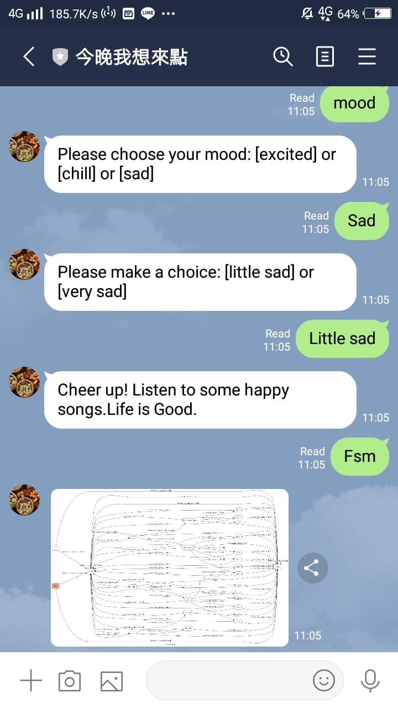
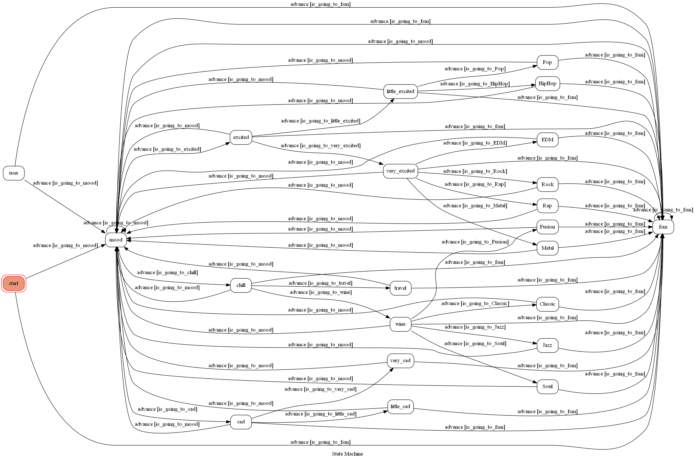

# TOC Project 2020

A Line bot based on a finite state machine

## Bot Description
- a bot that give recommendation for the genre of music the user would like to listen to according to his/her mood

## Usage

1. insert 'mood' , and choose your current mood

2. there are more choices in different mood

3. choose your favourite artist

4. and we will recommend you the appropriate genre of music for you to listen to

## Finite State Machine

## Reference
[Pipenv](https://medium.com/@chihsuan/pipenv-更簡單-更快速的-python-套件管理工具-135a47e504f4) ❤️ [@chihsuan](https://github.com/chihsuan)

[TOC-Project-2019](https://github.com/winonecheng/TOC-Project-2019) ❤️ [@winonecheng](https://github.com/winonecheng)

Flask Architecture ❤️ [@Sirius207](https://github.com/Sirius207)

[Line line-bot-sdk-python](https://github.com/line/line-bot-sdk-python/tree/master/examples/flask-echo)
